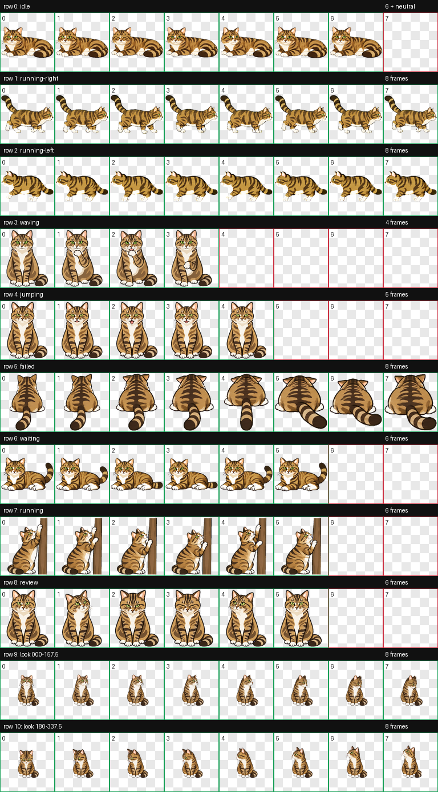

# Zhuzhu / 出竹嗷呜 — Codex Animated Pet

**Zhuzhu（出竹嗷呜）** 是一只生活在燕园的流浪猫。他又凶又胖又怂，我们超爱他。

这套 Codex 动画宠物保留了出竹的棕灰虎斑、白胸腹与白爪、绿色眼睛、不对称脸纹，以及左耳尖轻微平剪（流浪猫绝育标记）；整体采用无毛发纹理的平涂插画风格。



## 主要特点

- Codex v2 宠物格式
- 8 列 × 11 行精灵图，包含 9 个标准动画状态和 16 个注视方向
- 单帧尺寸：192 × 208
- 精灵图尺寸：1536 × 2288
- RGBA WebP 透明背景
- 根据真实猫咪外观、体态与性格定制动作

## 动作设计

| Codex 状态 | Zhuzhu 的动作 |
|---|---|
| 静止 `idle` | 以长而厚的卧姿躺着，轻微呼吸和眨眼 |
| 向右跑 `running-right` | 开心地向右小碎步，低头缩身、粗短腿，尾巴上翘 |
| 向左跑 `running-left` | 害怕地向左小碎步逃跑，尾巴下垂；严格侧视，只露近侧两只脚 |
| 挥手 `waving` | 舔前爪，不摆爪挥手 |
| 跳跃 `jumping` | 身体不跳、不离地，只张嘴叫 |
| 失败 `failed` | 伏低身体并背对画面 |
| 等待用户 `waiting` | 保持与 `idle` 一致的长厚卧姿，用尾巴拍打地面 |
| 正在工作 `running` | 侧身抱着窄竖树干，用粗前爪发力磨爪 |
| 审阅 `review` | 正面紧凑蹲坐，专注地检查 |

16 个注视方向的预览见 [`look-directions.png`](look-directions.png)。原始分辨率、透明背景且包含全部动作的精灵图见 [`all-actions-transparent.png`](all-actions-transparent.png)。

## 安装

下载本仓库后，将 `pet.json` 和 `spritesheet.webp` 复制到 Codex 的自定义宠物目录：

```bash
mkdir -p ~/.codex/pets/zhuzhu
cp pet.json spritesheet.webp ~/.codex/pets/zhuzhu/
```

重新打开 Codex，然后在宠物选择界面中选择 **出竹嗷呜**。

## 仓库结构

```text
zhuzhu-codex-pet/
├── LICENSE
├── README.md
├── pet.json
├── spritesheet.webp
├── all-actions-transparent.png
├── preview.png
└── look-directions.png
```

Codex 运行时只需要：

- `pet.json`：宠物名称、版本与精灵图路径
- `spritesheet.webp`：最终 v2 动画精灵图

其余文件用于 GitHub 展示、透明素材导出和授权说明。

## 许可协议

本仓库中的 Zhuzhu / 出竹嗷呜美术资源与相关文件采用 [Creative Commons Attribution-NonCommercial-NoDerivatives 4.0 International](https://creativecommons.org/licenses/by-nc-nd/4.0/deed.zh-hans)（**CC BY-NC-ND 4.0**）许可。

你可以下载并在自己的 Codex 中使用，也可以在保留署名和许可说明的前提下，以原始形式进行非商业分享。你不可以将资源用于商业目的，也不可以发布修改、重绘、换色、裁剪或重新编排后的衍生版本。

推荐署名：

> Zhuzhu / 出竹嗷呜 by Alice — CC BY-NC-ND 4.0
> https://github.com/AliceZXY12138/zhuzhu-codex-pet

完整条款请参阅 [`LICENSE`](LICENSE) 和 [Creative Commons 官方法律文本](https://creativecommons.org/licenses/by-nc-nd/4.0/legalcode.zh-hans)。

## English

Zhuzhu is a custom Codex v2 animated pet based on a real stray tabby cat living in Yanyuan. You may download it for personal use and share the original, unmodified files for non-commercial purposes with attribution. Commercial use and redistribution of modified versions are not permitted. See [`LICENSE`](LICENSE) for details.
